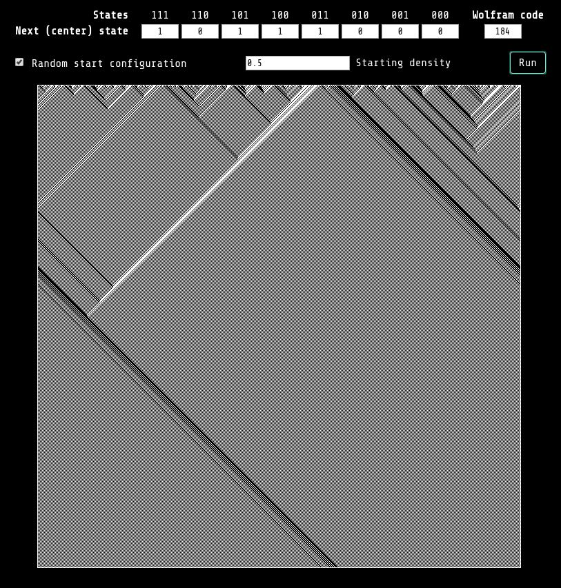

# Elementary cellular automata

Web app to explore the [elementary cellular automata](https://en.wikipedia.org/wiki/Elementary_cellular_automaton).

http://mhyfritz.com/elementary-cellular-automata/

## Usage

- you can either enter the [Wolfram code](https://en.wikipedia.org/wiki/Wolfram_code)
  (0-255) or set the individual states as bits (0/1)
- you can choose to use a random start configuration with a given density, otherwise
  only a single cell (the middle one) is active at the start
- finally, hit the `Run` button to view the time evoution

